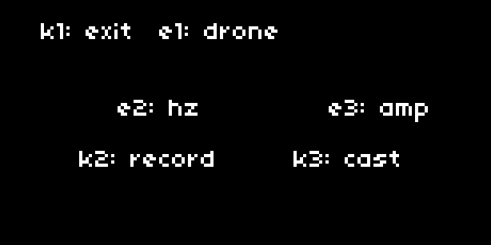

# dronecaster




# Installation

1. Install via maiden or clone/download the repo to `dust/code`.
2. Restart norns to pickup the SuperCollider Dronecaster engine.
3. Drone!

# Scene System

Dronecaster supports multiple visual styles while keeping audio completely unchanged.

## Current Scenes

**Classic** - Original vector graphics (birds, wind, antenna, lights)  
**Mountain** - Bitmap-based Mt. Zion scene with fog effects

Switch scenes: **PARAMS > scene**

## Adding a New Scene

### 1. Create scene file: `lib/scenes/yourscene/yourscene.lua`

```lua
local yourscene = {}
yourscene.name = "Your Scene"

local mlrs, mls, screen_levels  -- utils from draw.lua

function yourscene.init(utils)
  mlrs = utils.mlrs
  mls = utils.mls
  screen_levels = utils.screen_levels
end

function yourscene.render(playing_frame, recording_time, drone_name, 
                          hz, amp, playing, alt, alert, hz_num, amp_num)
  -- hz_num/amp_num are raw numbers (55.0, 0.4) - use these for animation
  -- hz/amp are formatted strings ("55 hz", "0.4 amp") - display only
  
  -- Your drawing code here
  screen.level(math.floor(amp_num * 15))
  screen.display_png("yourscene/assets/bg.png", 0, 0)
end

return yourscene
```

### 2. Register in `lib/draw.lua` → `draw.load_scenes()`

```lua
local success, yourscene = pcall(include, "lib/scenes/yourscene/yourscene")
if success and yourscene then
  local init_success, init_error = pcall(yourscene.init, utils)
  if init_success then
    scenes["Your Scene"] = yourscene
    table.insert(scene_names, "Your Scene")
    print("draw: loaded Your Scene")
  else
    print("draw: ERROR initializing Your Scene: " .. tostring(init_error))
  end
else
  print("draw: ERROR loading Your Scene file: " .. tostring(yourscene))
end
```

### 3. Reload - scene appears in PARAMS menu

## Render Parameters

- `playing_frame` - Frame counter (increments per second while playing)
- `playing` - Boolean, is sound currently playing
- `hz_num` - **Raw frequency** (e.g., 55.0) - animate with this
- `amp_num` - **Raw amplitude** (e.g., 0.4) - animate with this
- `hz` / `amp` - Pre-formatted strings (display only)
- Other params: `recording_time`, `drone_name`, `alt`, `alert`

## What Scenes Draw

**Scene draws:** Main visual area (artistic content)  
**draw.lua draws:** HUD (top menu, clock, play/stop icon, alerts)

## Graphics Tips

```lua
-- Bitmaps (must be grayscale PNG)
screen.display_png("path/to/image.png", x, y)

-- Blend modes
screen.blend_mode(0)  -- Normal (default)
screen.blend_mode(1)  -- Add
screen.blend_mode(6)  -- Darken (min of source/dest)

-- Brightness (0-15, no true alpha)
screen.level(15)  -- Brightest
screen.level(0)   -- Black

-- Layer by draw order
screen.display_png("bg.png", 0, 0)      -- Back
screen.display_png("fg.png", 0, 0)      -- Front (drawn last)
```

## Folder Structure

```
lib/scenes/
├── classic.lua              # Original vector scene
└── mountain/
    ├── mountain.lua         # Scene code
    └── assets/
        ├── tower.png        # Bitmap assets
        ├── fg_00.png
        ├── fg_01.png
        ├── fog_gradient_wide.png
        └── fog_noise_line.png
```

## Error Handling

Scene crashes won't crash dronecaster:
- `pcall()` wraps scene loading and rendering
- Errors logged to maiden with clear messages
- Fallback shows "SCENE ERROR" on screen
- Sound continues playing normally

# Contribute

We need more `SynthDefs`! Join the discussion on lines: [https://l.llllllll.co/dronecaster](https://l.llllllll.co/dronecaster)
